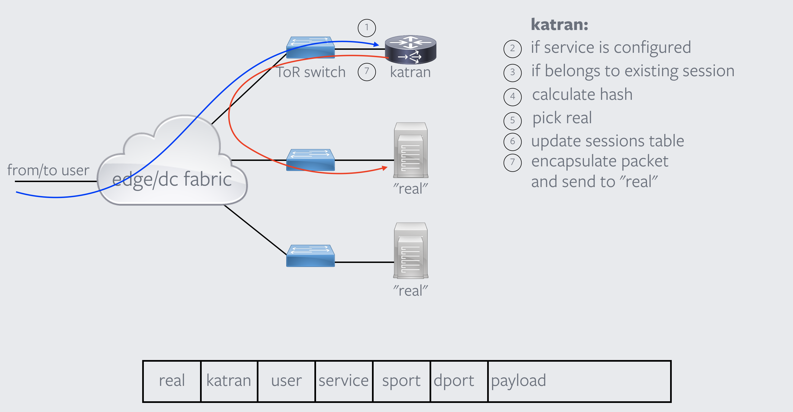
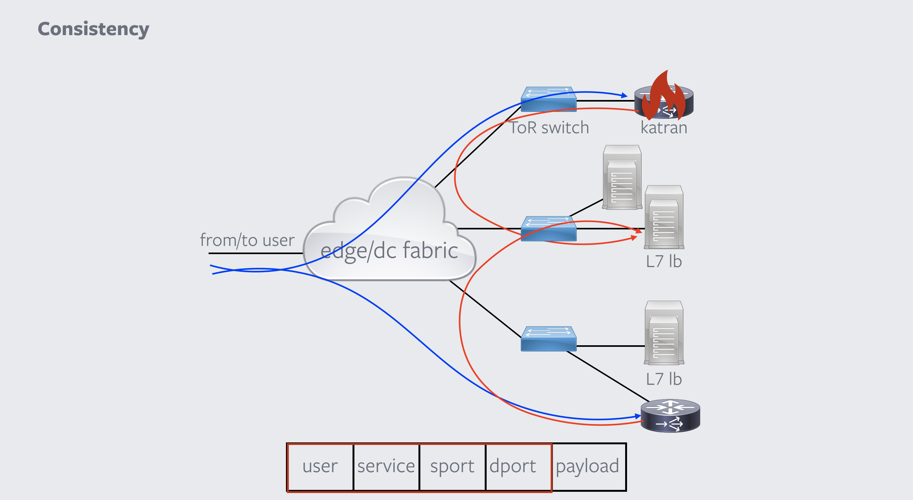

# katran

katran is a cpp library and bpf program to build high performance
layer 4 load balancing forwarding plane. katran leverages [XDP infrastructure](https://www.iovisor.org/technology/xdp)
from the kernel to provide in-kernel facility for fast packet's processing.

# katran's key features
1. blazing fast (especially w/ XDP in driver mode).
2. performance scaling linearly with a number of NIC's RX queues
3. RSS friendly encapsulation

See detailed features description bellow

# documentation's sections:
1. README (this file): generic overview of katran
2. USAGE: detailed description of how katran's library can be used, configured
or changed.
3. DEVELOPING: description of how developing process looks like: how to build
and test katran
4. EXAMPLE: output of how to run provided examples (thrift and grpc services,
which leverage katran library)

# examples of usage
We provide simple examples of katran library usage w/ thrift and grpc endpoints.
please refer to EXAMPLES.md for more detailed information.

# installation
We provide shell script that automates the build of katran for Ubuntu 18.04.
To build and install katran library and thrift/grpc examples - you need to run
build_katran.sh script. It should take care of all the required dependencies.
If you need to build it for other linux distributions, yon need to make sure that

1. it runs on recent linux kernel (4.13+)
2. you have installed:
  - [folly](https://github.com/facebook/folly)
  - recent version of clang compiler (6.0+)
  - glog/gtest/gflags/elf libraries
  - [wangle](https://github.com/facebook/wangle)
  - recent version of [linux kernel src](https://git.kernel.org/pub/scm/linux/kernel/git/torvalds/linux.git)
  - if you want to build examples [fbthrift](https://github.com/facebook/fbthrift) and [grpc](https://github.com/grpc/grpc) must be installed as well

# motivation behind layer 4 load balancing
Layer 4 load balancer (lb) enables to easily scale out Layer7 load balancers (the
ones which terminates TCP sessions). Benefits of L4 lb over other
techniques for scaling L7 lb is that it is
1. compared to DNS it doesn't need to wait TTL to redirect traffic from failed
L7 lb
2. compared to anycast based solution, L4 lbs are more resilient to the networking
related issues (which triggers mass ECMP reshuffle)/ enable better handling
of adding/removing of L7 lbs from the pool as well as provide better support for
unequal load balancing.

# environment requirements for katran to run
There are special requirements for katran to work properly. However, we do
believe that most of the potential users of the library can easily satisfy
them:
1. katran works only in DSR (direct service response) mode
2. Network topology should be L3 based (everything above top of the rack switch
  should be routed). This is because we are 'offloading' routing decision for
  sending packets to real server to first routing device (by unconditionally
  sending all packets from katran there)
3. katran doesn't support fragmentation (it cannot forward fragmented packet,
  nor it can fragment them by itself, if resulting packet size is bigger
  then MTU). This could be mitigated either by increasing MTU inside your
  network or by changing advertising TCP MSS from L7 lbs (this is recommended
  even if you have increased MTU, as it will prevent fragmentation related
  issues towards some of the client. For example, if instead of default TCP MSS
  1460 (for ipv4) you will advertise 1450 - it will help clients behind pppoe
  connection).
4. katran doesn't support packets w/ IP options set.
5. maximum packet size cannot be bigger than 3.5k (and 1.5k by default)
6. katran is built with assumption that it's going to be used in a
"load balancer on a stick" scenario: where single interface would be used both
for traffic "from user to L4 lb (ingress)" and "from L4 lb to L7 lb (egress)"

# L4 load balancing network topology

Steps:
1. katran receives packet
2. katran checks if the destination of the packet is configured as a VIP
  (virtual ip address - ip address of the service)
3. for an incoming packet toward a VIP - katran is checking if it saw packet from the same
  session before. If it has - it sends the packet to the same real (actual server/l7
    lb which then processes/terminates the tcp session)
4. if it's a new session - from 5 tuple in the packet, calculate a hash value
5. using this hash value - pick a real server
6. update session table with this lookup information, so that katran can simply
  lookup this information for the next packet in the session and not calculate
  the hash again
7. encapsulate packet in another ip packet and send to the real

# L4 load balancing failure scenario

As we use only the data from the packet's headers to calculate a hash value,
which is then used to pick a real server, different L4 lbs are consistent in
real server selection, even w/o explicit state sharing amongst each other.
This feature allow us to restart/drain single L4 lb w/o affecting TCP sessions,
going to the L7 lbs

# katran's features description
1. fast: katran uses XDP for packet forwarding, which allows
to run packet handling routines right after packet has been received by
network interface card (NIC) and before kernel had any chance to run (when XDP
is working in "driver mode", katran supports "generic XDP" mode of operation
as well (with some performance degradation compare to "driver mode"))
2. performance scales linearly with a number of NIC's RX queues: the way XDP
works is that it invokes bpf program on every received packet, and if your
NIC has multiple queues, for each of them BPF program will be invoked
independently. As katran is completely lockless and uses per-cpu
versions of BPF maps - it scales linearly.
3. RSS friendly encapsulation: katran is uses ipip encapsulation for packet
forwarding from L4 lb to L7 lb. However, to be able to work in conjunction with
RSS on L7 lb receive side, instead of using the same source for every ipip
packet, katran crafts a special one, in such a way, that different flows will have
different outer (ipip) source IP, but packets in same flow will always have
the same
4. fixed size (size is configurable on start) connection tracking table w/ LRU
strategy for eviction of old entries
5. modified Maglev hashing for connections: provides us good resiliency in
case of failure and excellent load balancing features. The hashing was modified
to be able to support unequal weights for backend (L7 lbs) servers
6. No need for busylooping on receive path: your load balancer will barely
consume any CPU if there is no traffic to serve
7. katran (and XDP in general) allows you to run any application w/o any
performance penalties on the same server (compare to some of other
"kernel bypass" technologies)

# trivia:
katran is named (it's actually an alternative name) after [spiny dogfish shark](https://en.wikipedia.org/wiki/Spiny_dogfish)

## License
katran is GPL-2.0 licensed, as found in the LICENSE file.
